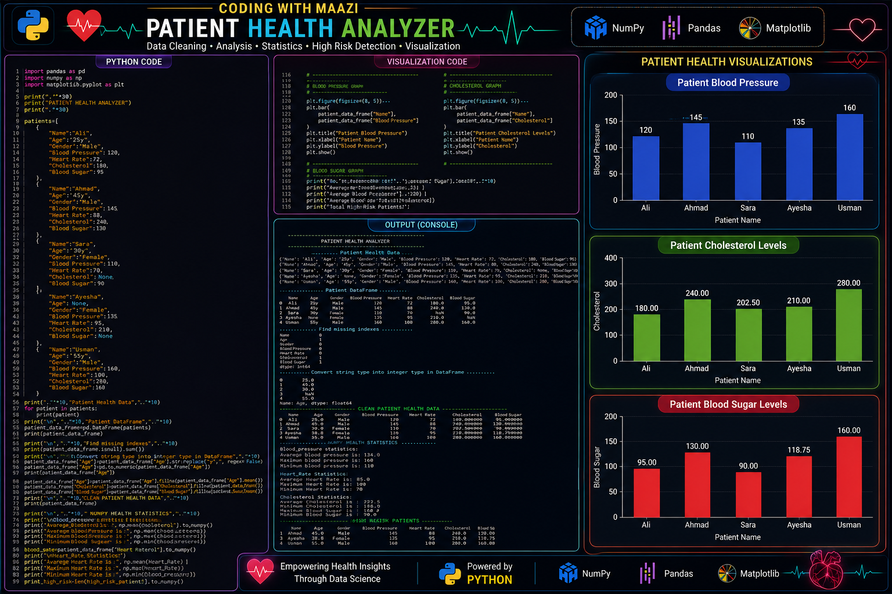

# 🧬 **PATIENT HEALTH ANALYZER**


## ❤️ **TURNING RAW PATIENT DATA INTO MEANINGFUL HEALTH INSIGHTS**

### **A PYTHON-BASED HEALTHCARE DATA ANALYSIS PROJECT**

**🐼 PANDAS • 🔢 NUMPY • 📊 MATPLOTLIB • 📈 SEABORN**

## 👨‍💻 **CODING WITH MAAZI**

</div>

---

## 📸 **PROJECT PREVIEW**



---

## 📌 **PROJECT OVERVIEW**

The **Patient Health Analyzer** is a Python-based healthcare data analysis project that transforms raw patient health records into meaningful insights.

The project performs **data cleaning, missing value handling, statistical analysis, high-risk patient detection, health summaries, and data visualization** using Python and powerful data science libraries.

---

## 🚀 **KEY FEATURES**

### 🧹 **DATA CLEANING**

Converts and prepares patient health data for analysis.

### ⚠️ **MISSING VALUE DETECTION**

Identifies missing values using Pandas.

### 🔧 **MISSING VALUE HANDLING**

Uses **`fillna()`** and column mean values to handle missing numerical data.

### 🔢 **NUMPY STATISTICAL ANALYSIS**

Calculates:

- **Average**
- **Maximum**
- **Minimum**

### 🚨 **HIGH-RISK PATIENT DETECTION**

Filters patients based on:

- ❤️ **High Blood Pressure**
- 🧪 **High Cholesterol**
- 🩸 **High Blood Sugar**

### 📊 **DATA VISUALIZATION**

Generates visualizations for:

- ❤️ **Patient Blood Pressure**
- 🧪 **Patient Cholesterol Levels**
- 🩸 **Patient Blood Sugar Levels**

### 📈 **VISUALIZATION PREVIEW**


---

## 🩺 **HEALTH INDICATORS ANALYZED**

- ❤️ **Blood Pressure**
- 💓 **Heart Rate**
- 🧪 **Cholesterol**
- 🩸 **Blood Sugar**
- 👤 **Age**
- ⚥ **Gender**

---

## 🛠️ **TECHNOLOGIES & LIBRARIES**

| **Technology** | **Purpose** |
|---|---|
| 🐍 **Python** | Core Programming Language |
| 🐼 **Pandas** | Data Manipulation & DataFrames |
| 🔢 **NumPy** | Statistical Calculations |
| 📊 **Matplotlib** | Data Visualization |
| 📈 **Seaborn** | Advanced Data Visualization |

---

## 📂 **PROJECT STRUCTURE**

```text
Patient_Health_Analyzer/
│
├── Patient Health Analyzer.py
├── patient_health_analyzer.png
├── requirements.txt
└── README.md
```

---

## 🔄 **PROJECT WORKFLOW**

```text
Patient Health Data
        │
        ▼
   DataFrame Creation
        │
        ▼
 Missing Value Detection
        │
        ▼
   Data Cleaning + fillna()
        │
        ▼
 NumPy Statistics
Mean • Maximum • Minimum
        │
        ▼
 High-Risk Patient Detection
        │
        ▼
 Complete Health Summary
        │
        ▼
 Data Visualization
```

---

## 🚨 **HIGH-RISK DETECTION CRITERIA**

Patients are identified as high-risk when one or more of the following conditions are met:

```text
Blood Pressure > 140
OR
Cholesterol > 220
OR
Blood Sugar > 120
```

This project demonstrates the use of **data filtering and logical conditions** to identify potentially high-risk patient records.

---

## 📊 **SKILLS DEMONSTRATED**

- 🐍 **Python Programming**
- 📦 **Lists & Dictionaries**
- 🔄 **Loops**
- 🐼 **Pandas DataFrames**
- ⚠️ **Missing Value Detection**
- 🧹 **Data Cleaning**
- 🔧 **`fillna()`**
- 🔢 **NumPy Statistics**
- 🔍 **Data Filtering**
- 🚨 **High-Risk Patient Detection**
- 📈 **Data Visualization**
- 🩺 **Healthcare Data Analysis**

---

## ⚠️ **DISCLAIMER**

This project is created for **educational and data analysis purposes only**. It is **not intended for medical diagnosis, treatment, or clinical decision-making**.

---


# ❤️ **TURNING HEALTHCARE DATA INTO POWERFUL INSIGHTS**

### **BUILT WITH PYTHON • PANDAS • NUMPY • SEABORN • MATPLOTLIB**

## 👨‍💻 **CODING WITH MAAZI**

### ⭐ **LEARNING • BUILDING • ANALYZING • GROWING**

---

# ✍️ **AUTHOR: MUHAMMAD MAAZ**

